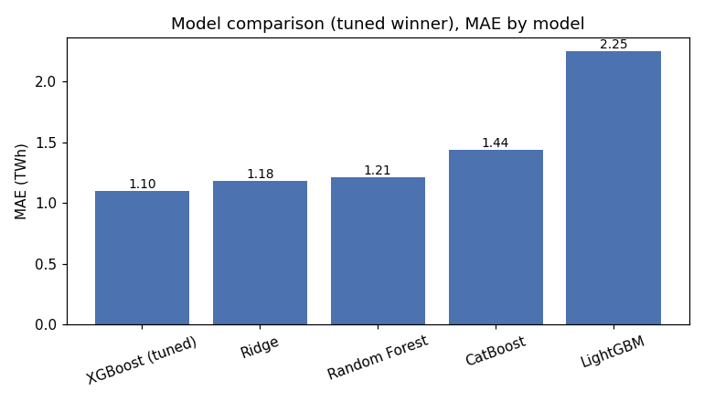
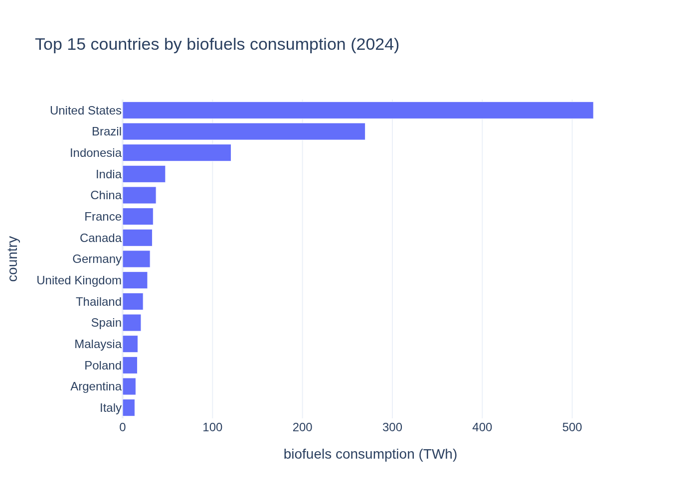

# Global biofuels consumption: modeling and country ranking

Predicting biofuels consumption by country and translating the results
into business metrics (CAGR, market penetration, regional ranking).

## Problem

Given a country's history and macro/energy context, how much will it
consume next year, and which countries have the most growth potential?
It's the kind of question that, at an agribusiness, energy, or
commodity trading company, feeds decisions about where to prioritize
markets.

## Dataset

Country-year panel 2000-2024, 107 countries, source
[Our World in Data - Global Energy dataset](https://github.com/owid/energy-data)
(which in turn consolidates the Energy Institute - Statistical Review
of World Energy, Ember, and the Maddison Project Database). "Biofuels"
is reported as a single consolidated metric covering biodiesel and
ethanol together. The source reports 108 countries; one (Netherlands
Antilles, a dissolved political entity with no current continent
classification) is excluded, since continent is one of the model's
features. Full detail on the source and how to regenerate the raw file
is in `data/raw/README.md`.

## Approach

1. **EDA** (`notebooks/01_eda.ipynb`): data quality, target
   distribution, consumption concentration, correlation with macro
   variables.
2. **Feature engineering** (`src/features.py`): continent mapping, GDP
   per capita, autoregressive lags (previous year's consumption/share/
   GDP, by country), 5-year CAGR, a flag for the countries that account
   for 80% of world consumption.
3. **Modeling** (`notebooks/02_modeling.ipynb`): six models in
   increasing order of complexity — `DummyRegressor` (floor), Ridge,
   Random Forest, XGBoost, LightGBM, CatBoost — each with its own
   preprocessing (Ridge needs scaling + one-hot, tree models don't;
   CatBoost uses `country` as a native categorical with 107 levels,
   with no need for one-hot). Temporal cross-validation (expanding
   window by year), not a single split, so the comparison doesn't
   depend on which countries happened to land in a fixed test set.
4. **Tuning**: a `RandomizedSearchCV`-style search and Optuna
   (Bayesian/TPE optimization) over the winning model, both run over
   the same temporal folds.
5. **Evaluation**: MAE/RMSE/R² with 95% bootstrap confidence
   intervals, plus a business metric (WMAE) that weights the error in
   the countries accounting for 80% of world consumption twice as
   heavily.
6. **Interpretability**: SHAP on the winning model.
7. **Business KPIs** (`notebooks/03_business_kpis.ipynb`): 5-year CAGR,
   penetration (% of primary energy), normalized score and ranking by
   continent, tables exported and ready for Power BI.

## Repo structure

```
biofuels-market-forecasting-en/
├── main.ipynb                    # entry point, with table of contents
├── notebooks/
│   ├── 01_eda.ipynb
│   ├── 02_modeling.ipynb
│   └── 03_business_kpis.ipynb
├── src/
│   ├── data.py                   # loading and cleaning
│   ├── features.py                # feature engineering
│   ├── modeling.py                # per-model pipelines + temporal CV
│   ├── tuning.py                  # random search + Optuna
│   ├── evaluation.py               # metrics + bootstrap + WMAE
│   ├── plots.py                   # matplotlib + Plotly
│   └── continent_map.json
├── data/
│   ├── raw/                       # raw dataset + source README
│   ├── processed/                 # feature panel, model comparison
│   └── exports/                   # tables ready for Power BI
├── models/                        # serialized final model
├── reports/figures/                # exported charts
├── requirements.txt
├── LICENSE (MIT)
└── README.md
```

## How to run

```bash
git clone https://github.com/virginiagalvan/biofuels-market-forecasting-en.git
cd biofuels-market-forecasting-en
pip install -r requirements.txt
jupyter notebook main.ipynb
```

A virtual environment is optional but recommended, to keep this
project's dependency versions isolated from any others installed on
your system:

```bash
python -m venv venv
source venv/bin/activate  # Windows: venv\Scripts\activate
```

The notebooks in `notebooks/` use relative paths and should be run
from that same folder.

## Results

| model | MAE (TWh) | 95% CI MAE | RMSE | R² | WMAE |
|---|---|---|---|---|---|
| XGBoost (tuned) | 1.10 | [0.86, 1.38] | 5.09 | 0.986 | 1.59 |
| Ridge | 1.18 | [1.01, 1.36] | 3.63 | 0.993 | 1.56 |
| Random Forest | 1.21 | [0.93, 1.49] | 5.74 | 0.983 | 1.80 |
| CatBoost | 1.44 | [1.10, 1.88] | 7.94 | 0.967 | 2.10 |
| LightGBM | 2.25 | [1.81, 2.72] | 9.42 | 0.955 | 3.38 |
| DummyRegressor (baseline) | 11.20 | [9.32, 13.50] | 44.62 | -0.009 | 16.80 |



XGBoost tuned with Optuna has the best point-estimate MAE, but its
confidence interval overlaps with Ridge's: **there is no evidence that
one model beats the other in a statistically significant way** on this
dataset.

Translated to business terms: for the 5 countries that account for 80%
of world consumption, the model's error is equivalent to ~8.5% of that
group's actual consumption; for the rest of the countries (102, with
much smaller consumption), the relative error rises to ~19.8%, though
in absolute volume it's minimal (0.55 TWh on average). The model is
proportionally less precise in small markets, but the cost of that
error is low in absolute terms.

World biofuels consumption in 2024: ~1,360 TWh, led by the United
States, with 55 countries reporting consumption above zero.



More charts (actual vs. predicted, SHAP, the business error breakdown)
and the full analysis are in `main.ipynb`.

## Technologies

Python · pandas · scikit-learn · XGBoost · LightGBM · CatBoost · Optuna ·
SHAP · Plotly · matplotlib

## Assumptions and considerations

- The target combines biodiesel and ethanol under "biofuels", per how
  the source dataset reports it.
- Countries with zero consumption stay in the panel (it's real
  information, not a missing value).
- Autoregressive features (`_lag1`) use only the previous year's
  information, so the setup is consistent with real forward-looking
  prediction use.

## Author

Virginia Galván, PhD — [LinkedIn](https://www.linkedin.com/in/virgina-galvan-390ba233b/)
